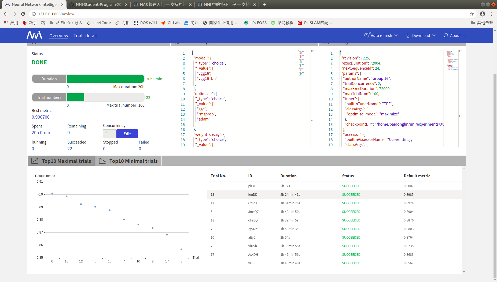

# HPO for CIFAR 10  

Search Space:  
```json
{
    "model": { "_type": "choice", "_value": ["resnext50_32x4d", "vgg16", "vgg16_bn","resnet50", "densenet121", "shufflenet_v2_x1_0", "mobilenet_v2", "squeezenet1_1", "resnet18","mnasnet1_0"] }, 
    "optimizer": { "_type": "choice", "_value": ["sgd", "rmsprop", "adam"] },
    "weight_decay": { "_type": "choice", "_value": [5e-4, 1e-4, 1e-3, 5e-5] },
    "momentum": { "_type": "choice", "_value": [0.9, 0.5, 0.99] },
    "batch_size": { "_type": "choice", "_value": [16, 32, 64, 128, 256] },
    "initial_lr": { "_type": "choice", "_value": [0.0001, 0.001, 0.01, 0.1] }
}
```

## Training Results
Note: Only the last experiment with the following search space is recorded.  
```json
{
    "model": { "_type": "choice", "_value": ["vgg16", "vgg16_bn"] }, 
    "optimizer": { "_type": "choice", "_value": ["sgd", "rmsprop", "adam"] },
    "weight_decay": { "_type": "choice", "_value": [5e-4, 1e-4, 1e-3, 5e-5] },
    "momentum": { "_type": "choice", "_value": [0.9, 0.5, 0.99] },
    "batch_size": { "_type": "choice", "_value": [128, 256] },
    "initial_lr": { "_type": "choice", "_value": [1e-5, 1e-4, 0.001, 0.01] }
}
```

Best Accuracy: 90.07%  
Best Parameters:  
```json
{
    "model": "vgg16",
    "optimizer": "sgd",
    "weight_decay": 0.0001,
    "momentum": 0.99,
    "batch_size": 128,
    "initial_lr": 0.001
}
```
Experiment Logs:  
[experiment.json][experiment_json]  [dispatcher.log][dispatcher_log]  [nnimanager.log][nnimanager_log]  [Best Trial(pk3Lj)][pk3Lj]  

Training Process:  


Snapshots:  




[experiment_json]: results/logfiles/experiment.json
[dispatcher_log]: results/logfiles/dispatcher.log
[nnimanager_log]: results/logfiles/nnimanager.log
[pk3Lj]: results/pk3Lj

